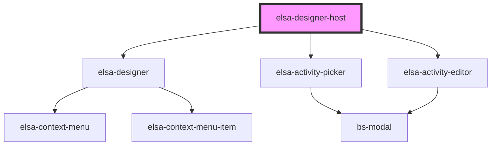

# elsa-designer-host

<!-- Auto Generated Below -->

## Properties

| Property              | Attribute  | Description | Type                   | Default     |
| --------------------- | ---------- | ----------- | ---------------------- | ----------- |
| `activityDefinitions` | --         |             | `ActivityDefinition[]` | `undefined` |
| `container`           | --         |             | `Container`            | `undefined` |
| `workflow`            | `workflow` |             | `Workflow \| string`   | `undefined` |

## Dependencies

### Depends on

- [elsa-designer](../designer)
- [elsa-activity-picker](../activity-picker)
- [elsa-activity-editor](../activity-editor)

### Graph

----------------------------------------------

*Built with [StencilJS](https://stenciljs.com/)*
