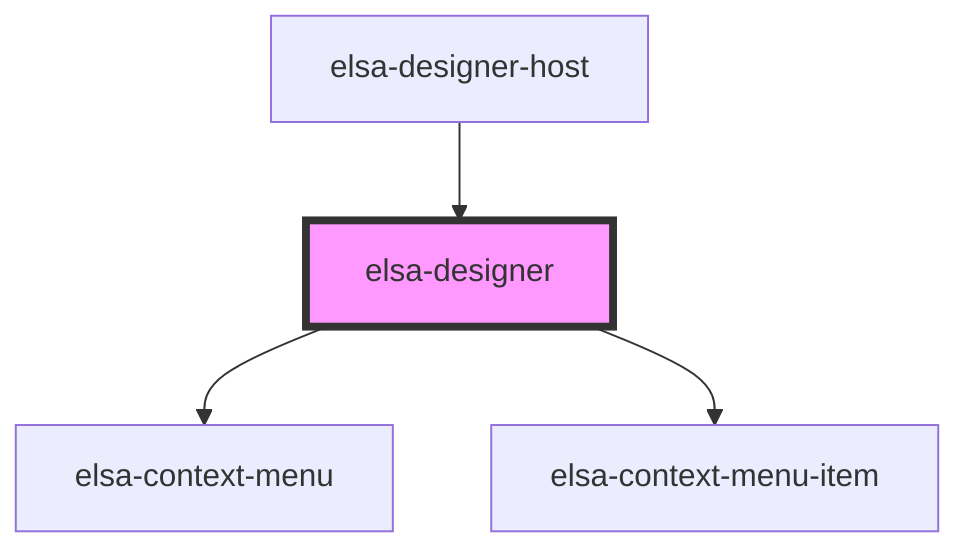

# elsa-designer

<!-- Auto Generated Below -->

## Properties

| Property              | Attribute  | Description | Type                   | Default     |
| --------------------- | ---------- | ----------- | ---------------------- | ----------- |
| `activityDefinitions` | --         |             | `ActivityDefinition[]` | `[]`        |
| `workflow`            | `workflow` |             | `Workflow \| string`   | `undefined` |

## Events

| Event           | Description | Type                            |
| --------------- | ----------- | ------------------------------- |
| `add-activity`  |             | `CustomEvent<AddActivityArgs>`  |
| `edit-activity` |             | `CustomEvent<EditActivityArgs>` |

## Methods

### `addActivity(activity: Activity) => Promise<void>`

#### Returns

Type: `Promise<void>`

### `getPan() => Promise<{ x: number; y: number; }>`

#### Returns

Type: `Promise<{ x: number; y: number; }>`

### `getScale() => Promise<number>`

#### Returns

Type: `Promise<number>`

### `getWorkflow() => Promise<Workflow>`

#### Returns

Type: `Promise<Workflow>`

## Dependencies

### Used by

 - [elsa-designer-host](../designer-host)

### Depends on

- [elsa-context-menu](../context-menu)
- [elsa-context-menu-item](../context-menu-item)

### Graph

----------------------------------------------

*Built with [StencilJS](https://stenciljs.com/)*
