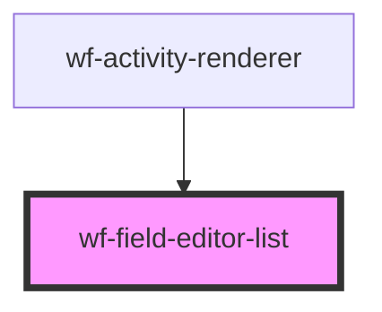

# wf-field-editor-text

<!-- Auto Generated Below -->

## Properties

| Property             | Attribute | Description | Type                         | Default     |
| -------------------- | --------- | ----------- | ---------------------------- | ----------- |
| `propertyDescriptor` | --        |             | `ActivityPropertyDescriptor` | `undefined` |
| `propertyValue`      | --        |             | `any[]`                      | `undefined` |

## Dependencies

### Used by

 - [wf-activity-renderer](..\..\workflow-designer\activity-renderer)

### Graph

----------------------------------------------

*Built with [StencilJS](https://stenciljs.com/)*
