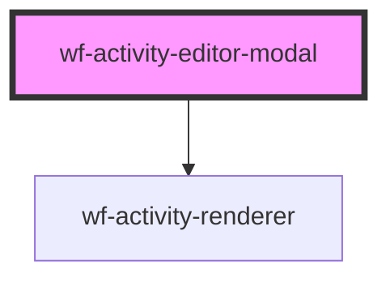

# wf-activity-editor

<!-- Auto Generated Below -->

## Properties

| Property   | Attribute | Description | Type       | Default     |
| ---------- | --------- | ----------- | ---------- | ----------- |
| `activity` | --        |             | `Activity` | `undefined` |

## Events

| Event             | Description | Type               |
| ----------------- | ----------- | ------------------ |
| `update-activity` |             | `CustomEvent<any>` |

## Methods

### `hide() => Promise<void>`

#### Returns

Type: `Promise<void>`

### `show() => Promise<void>`

#### Returns

Type: `Promise<void>`

## Dependencies

### Depends on

- [wf-activity-renderer](..\activity-renderer)

### Graph

----------------------------------------------

*Built with [StencilJS](https://stenciljs.com/)*
