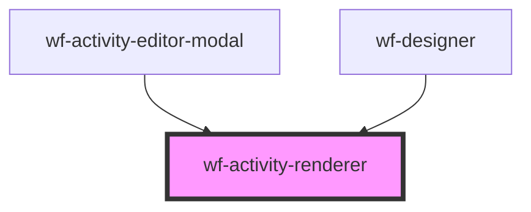

# wf-activity-renderer

<!-- Auto Generated Below -->

## Properties

| Property             | Attribute      | Description | Type                                                     | Default                      |
| -------------------- | -------------- | ----------- | -------------------------------------------------------- | ---------------------------- |
| `activity`           | --             |             | `Activity`                                               | `undefined`                  |
| `activityDefinition` | --             |             | `ActivityDefinition`                                     | `undefined`                  |
| `displayMode`        | `display-mode` |             | `ActivityDisplayMode.Design \| ActivityDisplayMode.Edit` | `ActivityDisplayMode.Design` |

## Dependencies

### Used by

 - [wf-activity-editor-modal](..\activity-editor-modal)
 - [wf-designer](..\designer)

### Graph

----------------------------------------------

*Built with [StencilJS](https://stenciljs.com/)*
