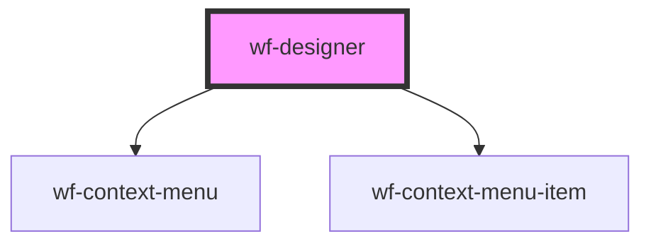

# workflow-canvas

<!-- Auto Generated Below -->

## Events

| Event           | Description | Type               |
| --------------- | ----------- | ------------------ |
| `add-activity`  |             | `CustomEvent<any>` |
| `edit-activity` |             | `CustomEvent<any>` |

## Methods

### `addActivity(activityDefinition: ActivityComponent) => Promise<void>`

#### Returns

Type: `Promise<void>`

### `export(format: WorkflowFormat) => Promise<any>`

#### Returns

Type: `Promise<any>`

### `updateActivity(activity: Activity) => Promise<void>`

#### Returns

Type: `Promise<void>`

## Dependencies

### Depends on

- [wf-context-menu](..\..\context-menu)
- [wf-context-menu-item](..\..\context-menu)

### Graph

----------------------------------------------

*Built with [StencilJS](https://stenciljs.com/)*
