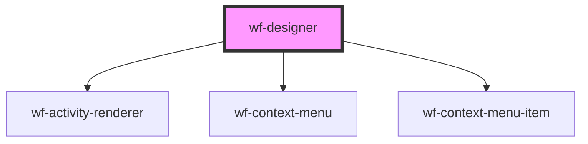

# workflow-canvas

<!-- Auto Generated Below -->

## Properties

| Property   | Attribute | Description | Type                                                     | Default                                         |
| ---------- | --------- | ----------- | -------------------------------------------------------- | ----------------------------------------------- |
| `workflow` | --        |             | `{ activities: Activity[]; connections: Connection[]; }` | `{     activities: [],     connections: []   }` |

## Events

| Event           | Description | Type               |
| --------------- | ----------- | ------------------ |
| `add-activity`  |             | `CustomEvent<any>` |
| `edit-activity` |             | `CustomEvent<any>` |

## Methods

### `addActivity(activityDefinition: ActivityDefinition) => Promise<void>`

#### Returns

Type: `Promise<void>`

### `updateActivity(activity: Activity) => Promise<void>`

#### Returns

Type: `Promise<void>`

## Dependencies

### Depends on

- [wf-activity-renderer](..\activity-renderer)
- [wf-context-menu](..\..\context-menu)
- [wf-context-menu-item](..\..\context-menu)

### Graph

----------------------------------------------

*Built with [StencilJS](https://stenciljs.com/)*
