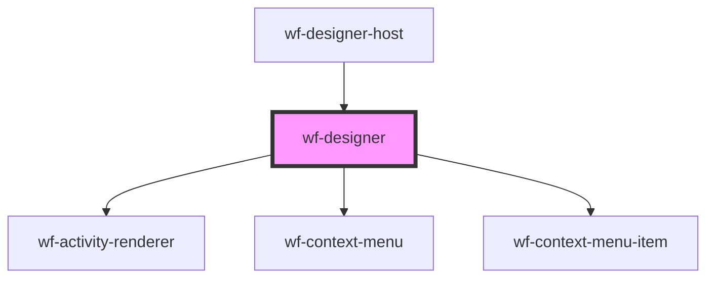

# workflow-canvas

<!-- Auto Generated Below -->

## Properties

| Property              | Attribute       | Description | Type                                                                                                                                                | Default                                         |
| --------------------- | --------------- | ----------- | --------------------------------------------------------------------------------------------------------------------------------------------------- | ----------------------------------------------- |
| `activityDefinitions` | --              |             | `ActivityDefinition[]`                                                                                                                              | `[]`                                            |
| `canvasHeight`        | `canvas-height` |             | `string`                                                                                                                                            | `undefined`                                     |
| `workflow`            | --              |             | `{ id?: string; name?: string; description?: string; version?: number; isPublished?: boolean; activities: Activity[]; connections: Connection[]; }` | `{     activities: [],     connections: []   }` |

## Events

| Event             | Description | Type               |
| ----------------- | ----------- | ------------------ |
| `add-activity`    |             | `CustomEvent<any>` |
| `edit-activity`   |             | `CustomEvent<any>` |
| `workflowChanged` |             | `CustomEvent<any>` |

## Methods

### `addActivity(activityDefinition: ActivityDefinition) => Promise<void>`

#### Returns

Type: `Promise<void>`

### `getWorkflow() => Promise<any>`

#### Returns

Type: `Promise<any>`

### `newWorkflow() => Promise<void>`

#### Returns

Type: `Promise<void>`

### `updateActivity(activity: Activity) => Promise<void>`

#### Returns

Type: `Promise<void>`

## Dependencies

### Used by

 - [wf-designer-host](..\designer-host)

### Depends on

- [wf-activity-renderer](..\activity-renderer)
- [wf-context-menu](..\..\context-menu)
- [wf-context-menu-item](..\..\context-menu)

### Graph

----------------------------------------------

*Built with [StencilJS](https://stenciljs.com/)*
