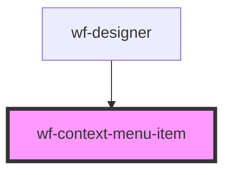

# wf-context-menu

<!-- Auto Generated Below -->

## Properties

| Property | Attribute | Description | Type  | Default     |
| -------- | --------- | ----------- | ----- | ----------- |
| `text`   | `text`    |             | `any` | `undefined` |

## Dependencies

### Used by

 - [wf-designer](..\workflow-designer\designer)

### Graph

----------------------------------------------

*Built with [StencilJS](https://stenciljs.com/)*
