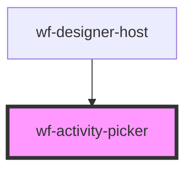

# wf-activity-picker

<!-- Auto Generated Below -->

## Properties

| Property              | Attribute | Description | Type                   | Default |
| --------------------- | --------- | ----------- | ---------------------- | ------- |
| `activityDefinitions` | --        |             | `ActivityDefinition[]` | `[]`    |

## Events

| Event             | Description | Type               |
| ----------------- | ----------- | ------------------ |
| `activity-picked` |             | `CustomEvent<any>` |

## Methods

### `hide() => Promise<void>`

#### Returns

Type: `Promise<void>`

### `show() => Promise<void>`

#### Returns

Type: `Promise<void>`

## Dependencies

### Used by

 - [wf-designer-host](..\designer-host)

### Graph

----------------------------------------------

*Built with [StencilJS](https://stenciljs.com/)*
