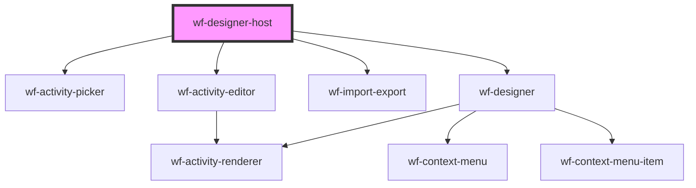

# wf-designer-host

<!-- Auto Generated Below -->

## Properties

| Property                  | Attribute                   | Description | Type                                                     | Default     |
| ------------------------- | --------------------------- | ----------- | -------------------------------------------------------- | ----------- |
| `activityDefinitionsData` | `data-activity-definitions` |             | `string`                                                 | `undefined` |
| `canvasHeight`            | `canvas-height`             |             | `string`                                                 | `undefined` |
| `pluginsData`             | `plugins`                   |             | `string`                                                 | `undefined` |
| `readonly`                | `readonly`                  |             | `boolean`                                                | `undefined` |
| `workflow`                | --                          |             | `{ activities: Activity[]; connections: Connection[]; }` | `undefined` |
| `workflowData`            | `data-workflow`             |             | `string`                                                 | `undefined` |

## Events

| Event             | Description | Type               |
| ----------------- | ----------- | ------------------ |
| `workflowChanged` |             | `CustomEvent<any>` |

## Methods

### `export(formatDescriptor: WorkflowFormatDescriptor) => Promise<void>`

#### Returns

Type: `Promise<void>`

### `getWorkflow() => Promise<any>`

#### Returns

Type: `Promise<any>`

### `import() => Promise<void>`

#### Returns

Type: `Promise<void>`

### `newWorkflow() => Promise<void>`

#### Returns

Type: `Promise<void>`

### `showActivityPicker() => Promise<void>`

#### Returns

Type: `Promise<void>`

## Dependencies

### Depends on

- [wf-activity-picker](..\activity-picker)
- [wf-activity-editor](..\activity-editor)
- [wf-import-export](..\import-export)
- [wf-designer](..\designer)

### Graph

----------------------------------------------

*Built with [StencilJS](https://stenciljs.com/)*
