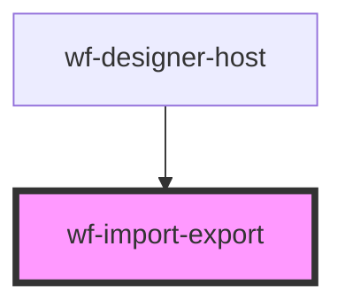

# wf-import-export

<!-- Auto Generated Below -->

## Events

| Event             | Description | Type                                                                  |
| ----------------- | ----------- | --------------------------------------------------------------------- |
| `import-workflow` |             | `CustomEvent<{ activities: Activity[]; connections: Connection[]; }>` |

## Methods

### `export(designer: HTMLWfDesignerElement, formatDescriptor: WorkflowFormatDescriptor) => Promise<void>`

#### Returns

Type: `Promise<void>`

### `import(data?: ImportedWorkflowData) => Promise<void>`

#### Returns

Type: `Promise<void>`

## Dependencies

### Used by

 - [wf-designer-host](..\designer-host)

### Graph

----------------------------------------------

*Built with [StencilJS](https://stenciljs.com/)*
