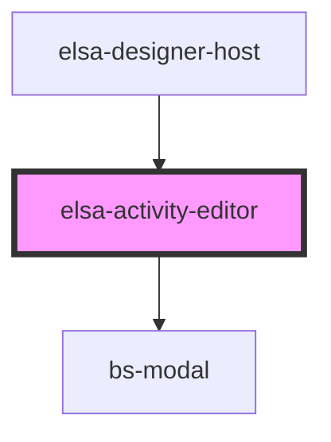

# elsa-activity-editor

<!-- Auto Generated Below -->

## Properties

| Property    | Attribute    | Description | Type        | Default     |
| ----------- | ------------ | ----------- | ----------- | ----------- |
| `activity`  | --           |             | `Activity`  | `undefined` |
| `container` | --           |             | `Container` | `undefined` |
| `showModal` | `show-modal` |             | `boolean`   | `undefined` |

## Events

| Event              | Description | Type                               |
| ------------------ | ----------- | ---------------------------------- |
| `activity-updated` |             | `CustomEvent<ActivityUpdatedArgs>` |
| `hidden`           |             | `CustomEvent<any>`                 |

## Dependencies

### Used by

 - [elsa-designer-host](../designer-host)

### Depends on

- bs-modal

### Graph

----------------------------------------------

*Built with [StencilJS](https://stenciljs.com/)*
