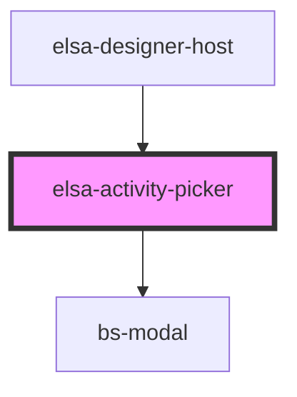

# elsa-activity-picker

<!-- Auto Generated Below -->

## Properties

| Property              | Attribute    | Description | Type                   | Default     |
| --------------------- | ------------ | ----------- | ---------------------- | ----------- |
| `activityDefinitions` | --           |             | `ActivityDefinition[]` | `[]`        |
| `container`           | --           |             | `Container`            | `undefined` |
| `showModal`           | `show-modal` |             | `boolean`              | `undefined` |

## Events

| Event               | Description | Type               |
| ------------------- | ----------- | ------------------ |
| `activity-selected` |             | `CustomEvent<any>` |
| `hidden`            |             | `CustomEvent<any>` |

## Dependencies

### Used by

 - [elsa-designer-host](../designer-host)

### Depends on

- bs-modal

### Graph

----------------------------------------------

*Built with [StencilJS](https://stenciljs.com/)*
