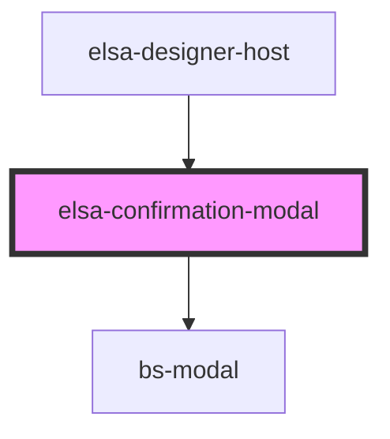

# elsa-confirmation-modal

<!-- Auto Generated Below -->

## Properties

| Property    | Attribute    | Description | Type      | Default     |
| ----------- | ------------ | ----------- | --------- | ----------- |
| `showModal` | `show-modal` |             | `boolean` | `undefined` |
| `title`     | `title`      |             | `string`  | `'Dialog'`  |

## Events

| Event       | Description | Type               |
| ----------- | ----------- | ------------------ |
| `confirmed` |             | `CustomEvent<any>` |
| `hidden`    |             | `CustomEvent<any>` |

## Dependencies

### Used by

 - [elsa-designer-host](../designer-host)

### Depends on

- bs-modal

### Graph

----------------------------------------------

*Built with [StencilJS](https://stenciljs.com/)*
