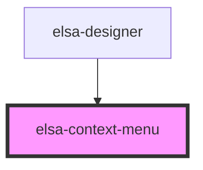

# elsa-context-menu

<!-- Auto Generated Below -->

## Events

| Event          | Description | Type               |
| -------------- | ----------- | ------------------ |
| `context-menu` |             | `CustomEvent<any>` |

## Methods

### `getContext() => Promise<any>`

#### Returns

Type: `Promise<any>`

### `show(e: MouseEvent, context?: any) => Promise<void>`

#### Returns

Type: `Promise<void>`

## Dependencies

### Used by

 - [elsa-designer](../designer)

### Graph

----------------------------------------------

*Built with [StencilJS](https://stenciljs.com/)*
