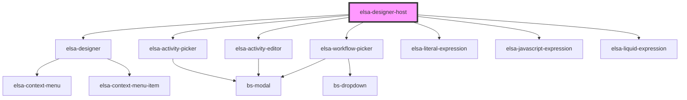

# elsa-designer-host

<!-- Auto Generated Below -->

## Properties

| Property    | Attribute    | Description | Type     | Default     |
| ----------- | ------------ | ----------- | -------- | ----------- |
| `serverUrl` | `server-url` |             | `string` | `undefined` |

## Methods

### `addActivityDriver(constructor: new (...args: any[]) => ActivityDriver) => Promise<void>`

#### Returns

Type: `Promise<void>`

### `addFieldDriver(constructor: new (...args: any[]) => FieldDriver) => Promise<void>`

#### Returns

Type: `Promise<void>`

### `configureServices(action: (container: Container) => void) => Promise<void>`

#### Returns

Type: `Promise<void>`

## Dependencies

### Depends on

- [elsa-designer](../designer)
- [elsa-activity-picker](../activity-picker)
- [elsa-activity-editor](../activity-editor)
- [elsa-workflow-picker](../workflow-picker)
- [elsa-literal-expression](../literal-expression)
- [elsa-javascript-expression](../javascript-expression)
- [elsa-liquid-expression](../liquid-expression)

### Graph

----------------------------------------------

*Built with [StencilJS](https://stenciljs.com/)*
