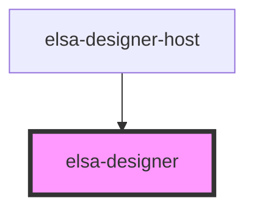

# elsa-designer

<!-- Auto Generated Below -->

## Properties

| Property              | Attribute  | Description | Type                   | Default              |
| --------------------- | ---------- | ----------- | ---------------------- | -------------------- |
| `activityDescriptors` | --         |             | `ActivityDescriptor[]` | `[]`                 |
| `readonly`            | `readonly` |             | `boolean`              | `undefined`          |
| `workflow`            | --         |             | `Workflow`             | `{...emptyWorkflow}` |

## Events

| Event                  | Description | Type                        |
| ---------------------- | ----------- | --------------------------- |
| `activity-contextmenu` |             | `CustomEvent<ActivityArgs>` |
| `activity-doubleclick` |             | `CustomEvent<ActivityArgs>` |
| `workflow-contextmenu` |             | `CustomEvent<WorkflowArgs>` |

## Methods

### `addActivity(activity: Activity) => Promise<void>`

#### Returns

Type: `Promise<void>`

### `deleteActivity(id: string) => Promise<void>`

#### Returns

Type: `Promise<void>`

### `getActivity(id: string) => Promise<Activity>`

#### Returns

Type: `Promise<Activity>`

### `getTransform() => Promise<{ x: number; y: number; scale: number; }>`

#### Returns

Type: `Promise<{ x: number; y: number; scale: number; }>`

### `getWorkflow() => Promise<Workflow>`

#### Returns

Type: `Promise<Workflow>`

### `registerService(action: (container: Container) => void) => Promise<void>`

#### Returns

Type: `Promise<void>`

### `updateActivity(activity: Activity) => Promise<void>`

#### Returns

Type: `Promise<void>`

## Dependencies

### Used by

 - [elsa-designer-host](../designer-host)

### Graph

----------------------------------------------

*Built with [StencilJS](https://stenciljs.com/)*
