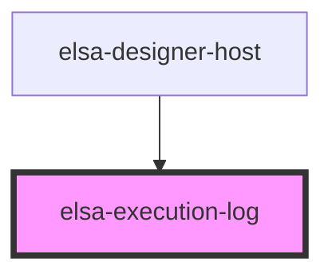

# elsa-execution-log

<!-- Auto Generated Below -->

## Properties

| Property              | Attribute | Description | Type                   | Default     |
| --------------------- | --------- | ----------- | ---------------------- | ----------- |
| `activityDescriptors` | --        |             | `ActivityDescriptor[]` | `[]`        |
| `log`                 | --        |             | `ExecutionLogEntry[]`  | `[]`        |
| `workflowDefinition`  | --        |             | `WorkflowDefinition`   | `undefined` |

## Dependencies

### Used by

 - [elsa-designer-host](../designer-host)

### Graph

----------------------------------------------

*Built with [StencilJS](https://stenciljs.com/)*
