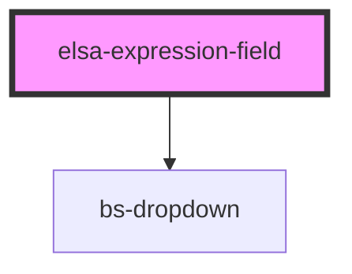

# elsa-expression-field

<!-- Auto Generated Below -->

## Properties

| Property         | Attribute    | Description | Type               | Default     |
| ---------------- | ------------ | ----------- | ------------------ | ----------- |
| `availableTypes` | --           |             | `ExpressionType[]` | `[]`        |
| `expression`     | `expression` |             | `any`              | `undefined` |
| `multiline`      | `multiline`  |             | `boolean`          | `undefined` |
| `name`           | `name`       |             | `string`           | `undefined` |
| `selectedType`   | --           |             | `ExpressionType`   | `undefined` |

## Dependencies

### Depends on

- bs-dropdown

### Graph

----------------------------------------------

*Built with [StencilJS](https://stenciljs.com/)*
