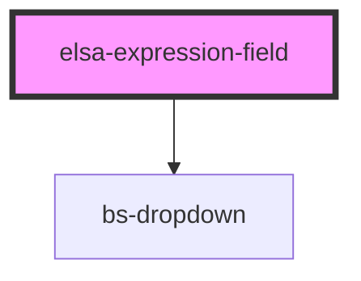

# elsa-expression-field

<!-- Auto Generated Below -->

## Properties

| Property         | Attribute      | Description | Type               | Default     |
| ---------------- | -------------- | ----------- | ------------------ | ----------- |
| `availableTypes` | --             |             | `ExpressionType[]` | `[]`        |
| `defaultType`    | `default-type` |             | `string`           | `'Literal'` |
| `expression`     | `expression`   |             | `string`           | `undefined` |
| `multiline`      | `multiline`    |             | `boolean`          | `undefined` |
| `name`           | `name`         |             | `string`           | `undefined` |
| `type`           | `type`         |             | `string`           | `undefined` |

## Methods

### `getExpression() => Promise<Expression>`

#### Returns

Type: `Promise<Expression>`

## Dependencies

### Depends on

- bs-dropdown

### Graph

----------------------------------------------

*Built with [StencilJS](https://stenciljs.com/)*
