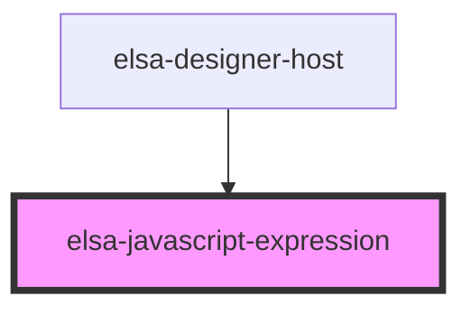

# elsa-javascript-expression

<!-- Auto Generated Below -->

## Properties

| Property     | Attribute    | Description | Type      | Default     |
| ------------ | ------------ | ----------- | --------- | ----------- |
| `expression` | `expression` |             | `string`  | `undefined` |
| `multiline`  | `multiline`  |             | `boolean` | `undefined` |
| `name`       | `name`       |             | `string`  | `undefined` |

## Events

| Event                | Description | Type                                 |
| -------------------- | ----------- | ------------------------------------ |
| `expression-changed` |             | `CustomEvent<ExpressionChangedArgs>` |

## Dependencies

### Used by

 - [elsa-designer-host](../designer-host)

### Graph

----------------------------------------------

*Built with [StencilJS](https://stenciljs.com/)*
