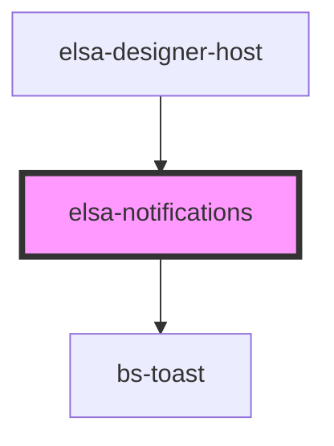

# elsa-notifications

<!-- Auto Generated Below -->

## Properties

| Property        | Attribute | Description | Type             | Default |
| --------------- | --------- | ----------- | ---------------- | ------- |
| `notifications` | --        |             | `Notification[]` | `[]`    |

## Dependencies

### Used by

 - [elsa-designer-host](../designer-host)

### Depends on

- bs-toast

### Graph

----------------------------------------------

*Built with [StencilJS](https://stenciljs.com/)*
