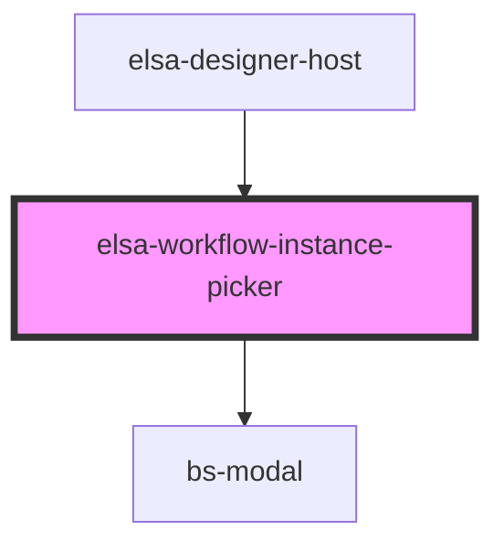

# elsa-workflow-instance-picker

<!-- Auto Generated Below -->

## Properties

| Property    | Attribute    | Description | Type                                                             | Default     |
| ----------- | ------------ | ----------- | ---------------------------------------------------------------- | ----------- |
| `container` | --           |             | `Container`                                                      | `undefined` |
| `showModal` | `show-modal` |             | `boolean`                                                        | `undefined` |
| `status`    | `status`     |             | `"COMPLETED" \| "FAULTED" \| "IDLE" \| "RUNNING" \| "SUSPENDED"` | `undefined` |
| `workflow`  | --           |             | `Workflow`                                                       | `undefined` |

## Events

| Event                        | Description | Type                                        |
| ---------------------------- | ----------- | ------------------------------------------- |
| `hidden`                     |             | `CustomEvent<any>`                          |
| `workflow-instance-selected` |             | `CustomEvent<WorkflowInstanceSelectedArgs>` |

## Dependencies

### Used by

 - [elsa-designer-host](../designer-host)

### Depends on

- bs-modal

### Graph

----------------------------------------------

*Built with [StencilJS](https://stenciljs.com/)*
