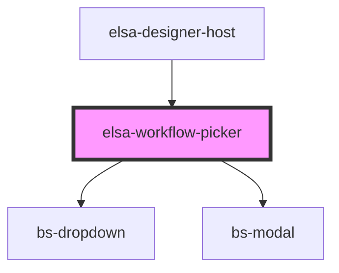

# elsa-workflow-picker

<!-- Auto Generated Below -->

## Properties

| Property    | Attribute    | Description | Type        | Default     |
| ----------- | ------------ | ----------- | ----------- | ----------- |
| `container` | --           |             | `Container` | `undefined` |
| `showModal` | `show-modal` |             | `boolean`   | `undefined` |

## Events

| Event                                  | Description | Type                                                 |
| -------------------------------------- | ----------- | ---------------------------------------------------- |
| `hidden`                               |             | `CustomEvent<any>`                                   |
| `workflow-definition-version-selected` |             | `CustomEvent<WorkflowDefinitionVersionSelectedArgs>` |

## Dependencies

### Used by

 - [elsa-designer-host](../designer-host)

### Depends on

- bs-dropdown
- bs-modal

### Graph

----------------------------------------------

*Built with [StencilJS](https://stenciljs.com/)*
